# Taxi Fare Prediction with Surcharge Estimation (NYC TLC Yellow Taxi)

## Overview

This project trains regression models to predict the **base metered fare** (`fare_amount`) of a completed NYC Yellow Taxi trip. The inputs are trip attributes: distance, duration, average speed, passenger count, pickup time, and a flag for incomplete trip metadata. It also trains two auxiliary models:

- **Surcharge model**: predicts `total_surcharge`, the sum of `extra`, `mta_tax`, `improvement_surcharge`, `congestion_surcharge`, `Airport_fee`, and `cbd_congestion_fee`.
- **Tolls model**: predicts `tolls_amount`. Tolls are route-dependent, not a fare rule, so they're modeled separately (see [Surcharge and tolls targets](#surcharge-and-tolls-targets)).

The data is official NYC Taxi & Limousine Commission (TLC) trip records. The pipeline does the following:
- Loads one or more monthly Parquet files.
- Removes invalid and outlier trips, logging a count for every rule.
- Engineers features and produces exploratory plots.
- Selects the fare model by **5-fold cross-validation on the training split**.
- Evaluates each final model on the held-out test set **exactly once**.
- Writes all metrics to `results/` and all plots to `figures/`.

Two rules keep targets out of the features:
- `total_amount` and `tip_amount` are never features.
- No surcharge component or toll is a feature of the surcharge or tolls models.

---

## Tech Stack

| Category | Items |
|---|---|
| Language | Python 3.13.5 (the version used for the committed results) |
| Data handling | pandas 2.3.0, numpy 2.2.6, pyarrow 21.0.0 (Parquet reading, column pruning, row-count metadata) |
| Machine learning | scikit-learn 1.7.2 (with scipy 1.16.0, joblib 1.5.2): `DummyRegressor`, `LinearRegression`, `Ridge`, `RandomForestRegressor`, `HistGradientBoostingRegressor`, `Pipeline`, `SimpleImputer`, `StandardScaler`, `KFold`, `cross_validate`, `GridSearchCV`, `permutation_importance` |
| Visualization | matplotlib 3.10.3 (non-interactive `Agg` backend) |
| Notebook | ipykernel 6.29.5 |
| Cloud / infra | None. Everything runs locally. |

All versions are pinned in `requirements.txt`.

---

## Project Structure

```text
taxi-fare-prediction-real-tlc/
├── README.md
├── requirements.txt           # Pinned dependencies
├── .gitignore                 # Ignores caches, venv and data/raw/*; figures/ and results/ are versioned
├── run_pipeline.py            # Entry point: main() runs the full pipeline
├── taxi_fare.ipynb            # Loads, cleans and feature-engineers the data interactively
├── data/raw/
│   └── yellow_tripdata_2025-01.parquet   # TLC Yellow Taxi, January 2025 (not versioned; see Dataset)
├── figures/                   # 11 PNGs produced by the pipeline
├── results/                   # summary.json, 3 CSVs, run_log.txt produced by the pipeline
└── src/
    ├── __init__.py
    ├── config.py              # ALL configuration: paths, input files, seed, sample size, CV folds, cleaning thresholds, hyperparameters
    ├── data_loading.py        # Reads only the needed columns from each listed file, samples proportionally, tags each row with its file's month
    ├── data_cleaning.py       # 11 ordered cleaning rules; each rule's removal count goes to the cleaning log
    ├── features.py            # Trip metrics (duration, speed), time features, missing-metadata flag, surcharge target, feature lists
    ├── training.py            # Candidate models, 5-fold CV, grid search, final fit, auxiliary (surcharge/tolls) models
    └── evaluation.py          # EDA plots, diagnostic plots, permutation importance, model comparison chart, VIF
```

---

## Pipeline / Architecture

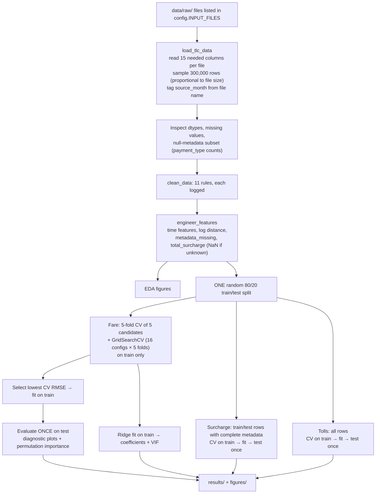

### Stage by stage

1. **Load** (`src/data_loading.py`):
   - Every file in `config.INPUT_FILES` is loaded explicitly. A missing file raises `FileNotFoundError` with the download link.
   - Only the 15 columns the pipeline uses are read. Column names are matched case-insensitively, since TLC releases vary (e.g. `airport_fee` vs `Airport_fee`). If a file predates the `Airport_fee` or `cbd_congestion_fee` column, that fee is filled with 0, because it wasn't charged then.
   - `SAMPLE_SIZE` rows are split across files in proportion to their row counts (largest-remainder rounding) and sampled with `random_state=42`.
   - Each row is tagged with `source_month` (the `YYYY-MM` in its file name).
2. **Inspect** (`run_pipeline.py`): prints dtypes and missing counts, and summarizes the null-metadata subset (see [Missing metadata](#missing-metadata-payment_type--0)).
3. **Clean** (`src/data_cleaning.py`): applies the rules below, in order.
4. **Features** (`src/features.py`): `trip_duration_min` and `avg_speed_mph` are created by `add_trip_metrics`, which cleaning calls so the duration and speed rules can use them. `engineer_features` then adds:
   - `pickup_hour`, `day_of_week`, `is_weekend`, `is_rush_hour` (hours 7–9 and 16–19)
   - `log_trip_distance`
   - `metadata_missing`
   - `total_surcharge`
5. **EDA** (`evaluation.save_eda_plots`): six figures. The surcharge plot uses only rows with a known surcharge.
6. **Split**: a single `train_test_split(test_size=0.20, random_state=42)` of row indices. All three models use it. The surcharge model further restricts both sides to rows with complete metadata.
7. **Fare model selection**: every candidate is scored with `KFold(5, shuffle=True, random_state=42)` on the training split. The lowest mean CV RMSE wins. That model is fitted on the whole training split, then scored on the test split once.
8. **Interpretation**:
   - Permutation importance of the selected model on the test split, after selection is final; nothing is chosen based on it.
   - Ridge coefficients (standardized features) with variance inflation factors, computed on the training split.
9. **Surcharge and tolls models**: `HistGradientBoostingRegressor`, 5-fold CV on train, fitted on train, scored on test once.
10. **Save**: `results/summary.json`, `model_comparison.csv`, `permutation_importance.csv`, `ridge_coefficients.csv`, and 11 figures.

---

## Methods

### Cleaning rules

Thresholds live in `src/config.py`. The percentiles below come from the 300k-row sample of January 2025, after dropping non-positive fares and distances.

| # | Rule (row removed if…) | Why |
|---|---|---|
| 1 | Pickup or dropoff timestamp can't be parsed | Unusable record |
| 2 | Pickup month ≠ month in the file name | TLC files contain stray records; the January file has pickups from 2024-12-31 to 2025-02-01 |
| 3 | Duration non-finite or ≤ 0 min | Impossible trip |
| 4 | Duration > **180 min** | p99.9 = 99.8 min, but p99.99 = 1,428.6 min: the meter was left running. 3 h is well beyond any in-city trip |
| 5 | Distance non-finite or ≤ 0 mi | Impossible trip |
| 6 | Distance > **100 mi** | p99.99 = 54.2 mi. The largest sampled values (18,173 to 92,186 mi) are odometer errors, while legitimate long trips reach about 76 mi |
| 7 | Fare non-finite or ≤ $0 | Refunds, voids, and disputes aren't fares to predict |
| 8 | Fare > **$500** | p99.99 = $279.66 and the sample max is $500.00, so this removes nothing here. It guards against corrupt values, like the $863,372 fare in the full January file |
| 9 | `passenger_count` ≤ 0 (missing is **kept**) | Recorded zero passengers |
| 10 | `passenger_count` > 6 | Above a yellow cab's legal capacity |
| 11 | Average speed non-finite or > **80 mph** | Physically implausible in NYC |

### Missing metadata (`payment_type == 0`)

In the 300,000-row sample, **46,508 rows (15.50%)** are null in `passenger_count`, `RatecodeID`, `store_and_fwd_flag`, `congestion_surcharge`, and `Airport_fee`. The overlap is complete: 46,508 rows have any of these null, and 46,508 have all of them null. `payment_type.value_counts()` on that subset gives **`0`: 46,508**, so every one of these rows is a payment-type-0 record. The TLC data dictionary lists code 0 as "Flex Fare trip"; check the current dictionary for the exact definition. After cleaning, 35,584 of these rows remain.

What the pipeline does with them:
- **Fare model**: the rows are kept. `passenger_count` is median-imputed inside the model pipeline (fit on training folds only), and `metadata_missing` (1 for these rows) is added as a feature.
- **Surcharge model**: the rows are **excluded**. Their `congestion_surcharge` and `Airport_fee` are unknown, so `total_surcharge` is set to NaN rather than 0. That removes 28,470 train rows and 7,114 test rows.
- **Tolls model**: the rows are kept, with `metadata_missing` as a feature, because `tolls_amount` isn't null for them.

### Surcharge and tolls targets

- `total_surcharge` = `extra` + `mta_tax` + `improvement_surcharge` + `congestion_surcharge` + `Airport_fee` + `cbd_congestion_fee`. It's NaN if any component is null.
- `tolls_amount` is **not** part of the surcharge. A surcharge is set by fare rules (time of day, congestion zone, airport), but a toll depends on which bridge or tunnel the route used. So tolls are modeled separately as their own target.

### Features

| Model | Features | Target | Rows |
|---|---|---|---|
| Fare | `trip_distance`, `trip_duration_min`, `passenger_count`, `avg_speed_mph`, `pickup_hour`, `day_of_week`, `is_weekend`, `is_rush_hour`, `log_trip_distance`, `metadata_missing` | `fare_amount` | all cleaned |
| Surcharge | `trip_distance`, `trip_duration_min`, `passenger_count`, `avg_speed_mph`, `pickup_hour`, `day_of_week`, `is_weekend`, `is_rush_hour` | `total_surcharge` | complete metadata only |
| Tolls | Surcharge features + `metadata_missing` | `tolls_amount` | all cleaned |

### Models and hyperparameters (fare)

Each fare model is a `Pipeline`: `SimpleImputer(median)` → (`StandardScaler` for the linear models only) → estimator. `random_state=42` everywhere (`config.RANDOM_STATE`).

| Name | Estimator | Hyperparameters |
|---|---|---|
| Mean Baseline | `DummyRegressor` | `strategy="mean"` |
| Linear Regression | `LinearRegression` | defaults |
| Ridge | `Ridge` | `alpha=1.0` |
| Random Forest | `RandomForestRegressor` | `n_estimators=150`, `max_features="sqrt"`, `min_samples_leaf=2`, `n_jobs=-1` |
| HistGradientBoosting | `HistGradientBoostingRegressor` | `max_iter=150`, `learning_rate=0.08`, `max_leaf_nodes=31` |
| Tuned HistGradientBoosting | `GridSearchCV` over the HGB pipeline | `learning_rate` ∈ {0.05, 0.08}, `max_iter` ∈ {100, 150}, `max_leaf_nodes` ∈ {15, 31}, `l2_regularization` ∈ {0.0, 0.5}; 5-fold, `refit` on RMSE |

The surcharge and tolls models are `HistGradientBoostingRegressor(max_iter=100, learning_rate=0.08, max_leaf_nodes=31)` with no imputer, since HGB handles NaN natively.

scikit-learn's HGB default `early_stopping="auto"` is left on. It activates above 10,000 samples, so `max_iter` is an upper bound rather than the number of boosting iterations actually run.

### Evaluation

- **Metrics**: MAE, RMSE, R².
- **Model selection**: lowest mean 5-fold CV RMSE on the training split.
- **Test set**: used once per final model: the selected fare model, the surcharge model, and the tolls model. The test set isn't used for any choice.
- **Improvement over baseline**: `100 × (baseline CV RMSE − selected CV RMSE) / baseline CV RMSE`.
- **Interpretation**:
  - Permutation importance on the test split (5 repeats, RMSE scoring).
  - Ridge coefficients on standardized features, reported with each feature's VIF so collinearity is visible.

---

## Dataset

- **Source**: NYC TLC Yellow Taxi Trip Record Data, https://www.nyc.gov/site/tlc/about/tlc-trip-record-data.page
- **File used**: `yellow_tripdata_2025-01.parquet` (January 2025), **3,475,226 rows**, 20 columns, of which 15 are read.
- **Sample**: 300,000 rows (`random_state=42`). After cleaning, **278,539 rows** remain.
- **Split**: 222,831 train / 55,708 test (80/20, random). The surcharge model uses 194,361 / 48,594 of those rows.
- **Multiple months**: add file names to `INPUT_FILES` in `src/config.py`. The sample is spread across files in proportion to their size, and each file's pickups are checked against that file's own month.

`data/raw/` is git-ignored (about 57 MB per month). Download the file from the TLC page into `data/raw/`.

---

## Setup and Installation

Prerequisites: Python 3.13, and enough RAM to hold the 15 selected columns of every input month (about 3.5M rows per month) before sampling.

```powershell
python -m venv .venv
.venv\Scripts\activate          # macOS/Linux: source .venv/bin/activate
pip install -r requirements.txt
```

To open the notebook in a browser you also need `pip install notebook` (not pinned). VS Code can use `ipykernel` directly.

---

## How to Run

```powershell
python run_pipeline.py
```

This works from any working directory, because the script puts its own folder on `sys.path`. Everything is configured in `src/config.py`; there are no CLI arguments.

**Console output**:
- File and row counts, dtypes, missing values
- The null-metadata subset summary
- The cleaning log
- Timestamped progress lines for each model
- The full `summary.json`

The committed `results/run_log.txt` is the console output of the run that produced the committed results. On this machine (32 logical cores), full runs took 91 s and 179 s.

**Outputs**:

| Path | Content |
|---|---|
| `results/summary.json` | Source/sample/final row counts, config, null-subset analysis, cleaning log, split sizes, fare CV table, selected model, fare test metrics, surcharge and tolls CV + test metrics, top features |
| `results/model_comparison.csv` | CV MAE / RMSE / RMSE std / R² for all 6 fare candidates |
| `results/permutation_importance.csv` | Permutation importance (mean, std) of the selected fare model |
| `results/ridge_coefficients.csv` | Ridge coefficients (standardized) and VIF per feature |
| `results/run_log.txt` | Console output of the run |
| `figures/fare_distribution.png`, `fare_vs_distance.png`, `fare_vs_duration.png`, `fare_by_hour.png`, `correlation_heatmap.png`, `surcharge_effect.png` | EDA |
| `figures/best_model_actual_vs_predicted.png`, `best_model_residuals.png`, `best_model_residual_histogram.png` | Selected fare model on the test set |
| `figures/feature_importance.png` | Top-10 permutation importance |
| `figures/model_comparison.png` | CV RMSE ± std per candidate |

**Notebook**: `jupyter notebook taxi_fare.ipynb`, or open it in VS Code. It finds the project root itself, then loads, cleans, and feature-engineers the data. Modeling runs only in `run_pipeline.py`.

---

## Results

All numbers below come from `results/summary.json` and the CSVs in `results/`, produced by `python run_pipeline.py` on `yellow_tripdata_2025-01.parquet`. They are rounded to 3 decimals; the files have full precision. Units are US dollars.

### Cleaning log (300,000 sampled rows)

| Rule | Removed |
|---|---|
| Invalid timestamps | 0 |
| Pickup outside source month | 1 |
| Non-positive duration | 157 |
| Duration > 180 min | 129 |
| Non-positive distance | 7,690 |
| Distance > 100 mi | 15 |
| Non-positive fare | 11,403 |
| Fare > $500 | 0 |
| Passenger count ≤ 0 | 2,005 |
| Passenger count > 6 | 0 |
| Speed > 80 mph | 61 |
| **Final rows** | **278,539** |

### Exploratory plots (cleaned data)

<table>
  <tr>
    <td>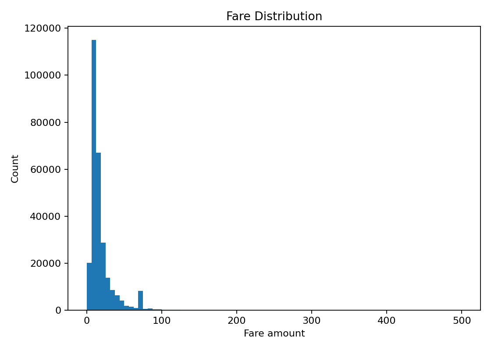</td>
    <td>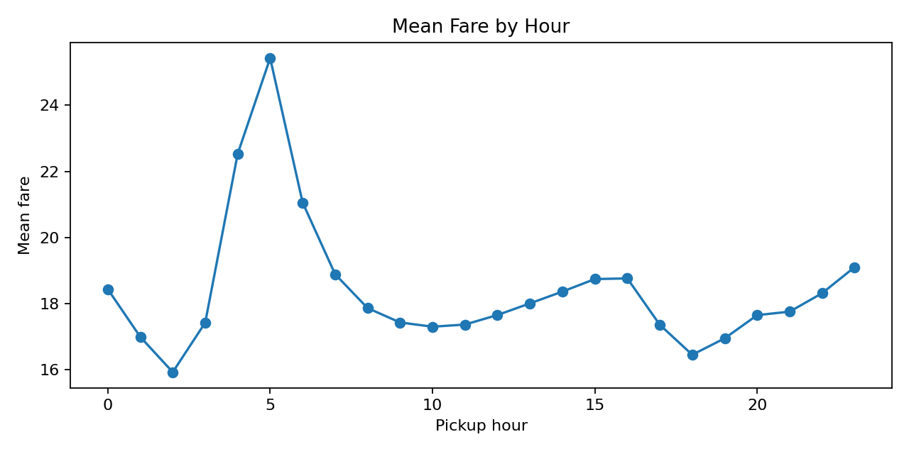</td>
  </tr>
  <tr>
    <td align="center"><em>Fare distribution</em></td>
    <td align="center"><em>Mean fare by pickup hour</em></td>
  </tr>
  <tr>
    <td>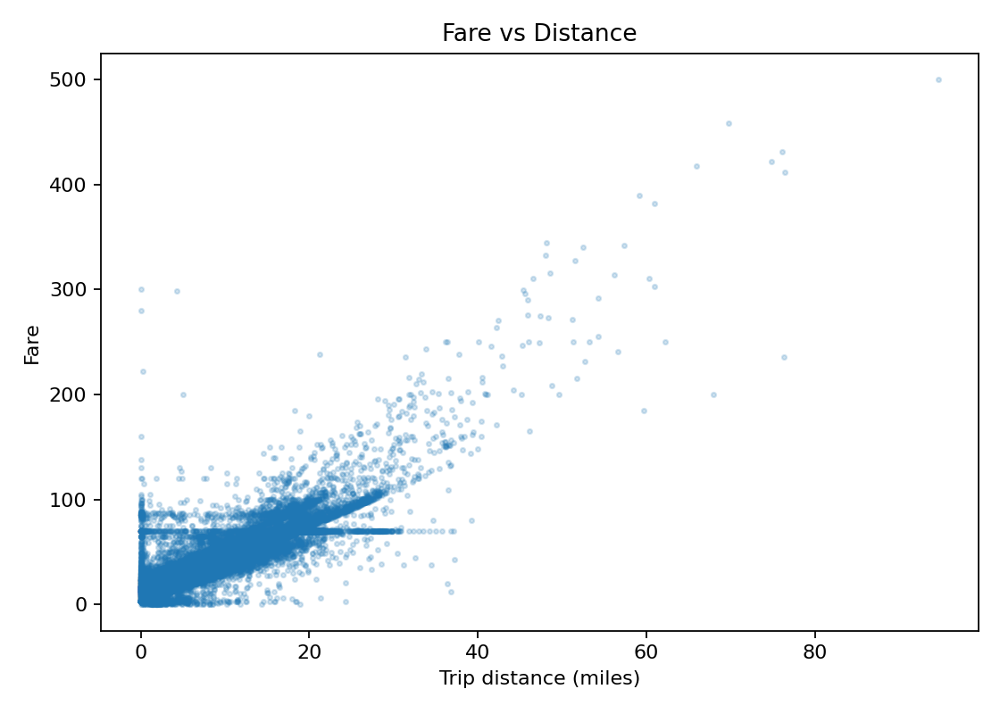</td>
    <td>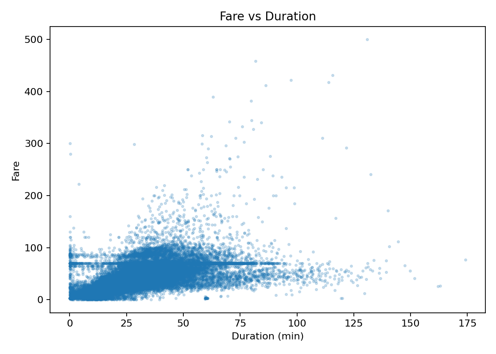</td>
  </tr>
  <tr>
    <td align="center"><em>Fare vs distance</em></td>
    <td align="center"><em>Fare vs duration</em></td>
  </tr>
  <tr>
    <td>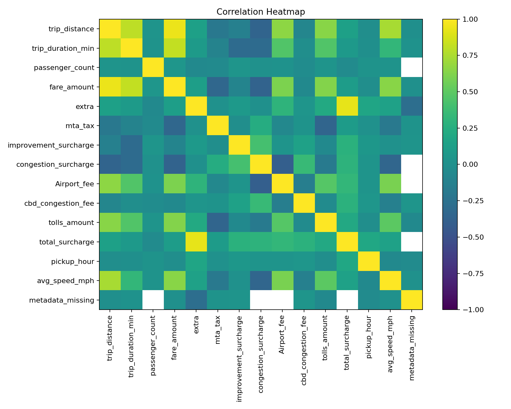</td>
    <td>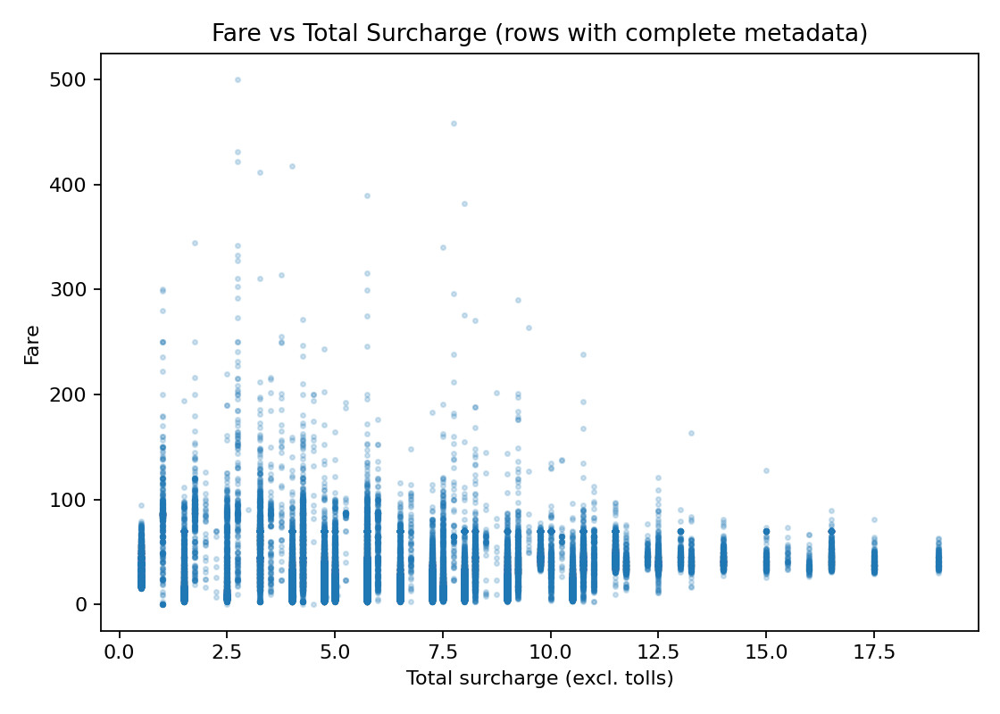</td>
  </tr>
  <tr>
    <td align="center"><em>Correlation heatmap (pairwise)</em></td>
    <td align="center"><em>Fare vs total surcharge (complete-metadata rows)</em></td>
  </tr>
</table>

### Fare model: 5-fold CV on the training split (222,831 rows)

| Model | CV MAE | CV RMSE (± std) | CV R² |
|---|---|---|---|
| Mean Baseline | 10.329 | 16.247 ± 0.408 | −0.000 |
| Linear Regression | 1.991 | 5.291 ± 0.227 | 0.894 |
| Ridge | 1.991 | 5.291 ± 0.227 | 0.894 |
| **Random Forest (selected)** | 1.329 | 4.431 ± 0.131 | 0.926 |
| HistGradientBoosting | 1.342 | 4.515 ± 0.180 | 0.923 |
| Tuned HistGradientBoosting | 1.343 | 4.514 ± 0.183 | 0.923 |

- Selected model: **Random Forest**. Its CV RMSE is 72.725% lower than the mean baseline's.
- Best grid-search parameters: `learning_rate=0.08`, `max_iter=100`, `max_leaf_nodes=31`, `l2_regularization=0.0`. Tuning didn't meaningfully beat the untuned HGB.

<p align="center">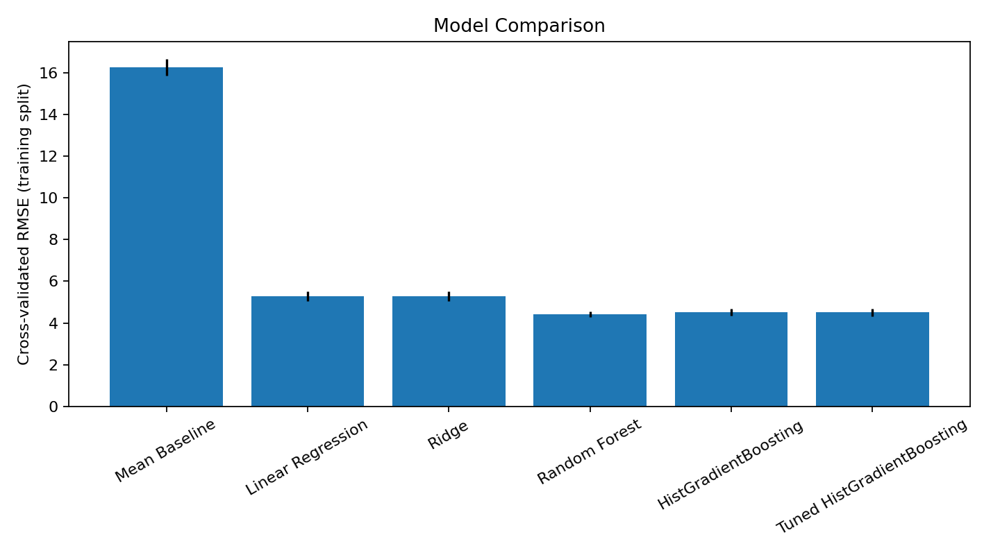</p>

### Final test-set evaluation (each evaluated once)

| Model | Test rows | MAE | RMSE | R² |
|---|---|---|---|---|
| Fare (Random Forest) | 55,708 | 1.305 | 4.175 | 0.933 |
| Surcharge (HGB) | 48,594 | 1.047 | 1.640 | 0.457 |
| Tolls (HGB) | 55,708 | 0.399 | 1.395 | 0.507 |

For reference, the surcharge model's CV RMSE was 1.638 ± 0.006 (R² 0.459), and the tolls model's was 1.394 ± 0.024 (R² 0.520).

**Selected fare model (Random Forest) on the test set:**

<table>
  <tr>
    <td>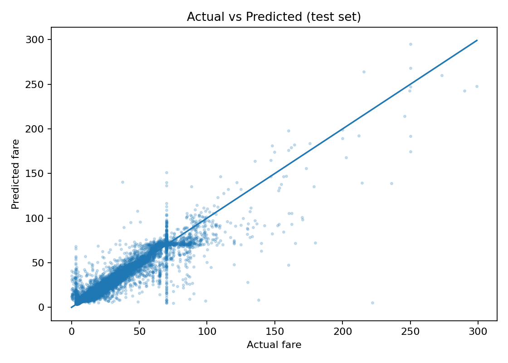</td>
    <td>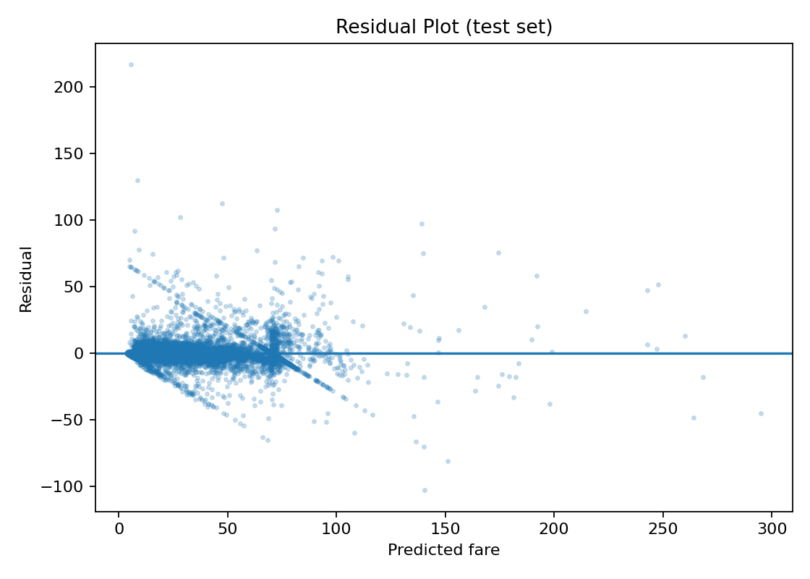</td>
    <td>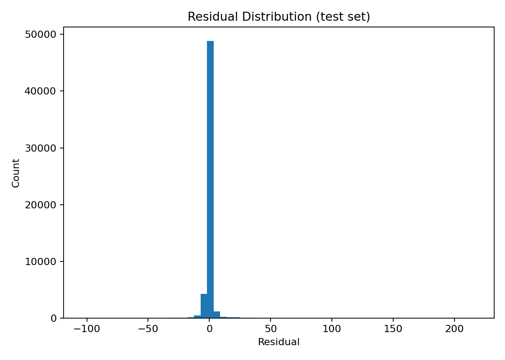</td>
  </tr>
  <tr>
    <td align="center"><em>Actual vs predicted</em></td>
    <td align="center"><em>Residuals vs predicted</em></td>
    <td align="center"><em>Residual distribution</em></td>
  </tr>
</table>

### Permutation importance (Random Forest, test split; increase in RMSE)

| Feature | Importance (mean ± std) |
|---|---|
| log_trip_distance | 5.679 ± 0.034 |
| trip_distance | 5.125 ± 0.030 |
| trip_duration_min | 2.500 ± 0.021 |
| avg_speed_mph | 1.017 ± 0.027 |
| metadata_missing | 0.148 ± 0.012 |
| pickup_hour | 0.084 ± 0.021 |
| passenger_count | 0.071 ± 0.004 |
| is_rush_hour | 0.021 ± 0.008 |
| day_of_week | 0.009 ± 0.003 |
| is_weekend | 0.003 ± 0.005 |

<p align="center">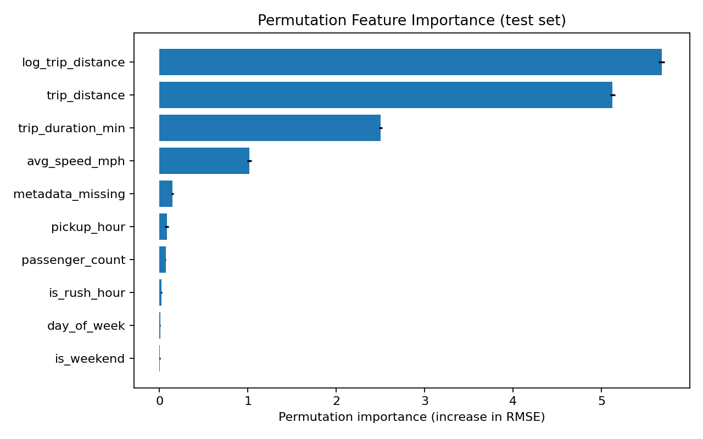</p>

### Ridge coefficients (standardized features) with VIF

| Feature | Coefficient | VIF |
|---|---|---|
| trip_distance | 13.528 | 9.94 |
| trip_duration_min | 3.037 | 10.27 |
| log_trip_distance | −0.744 | 13.56 |
| passenger_count | 0.214 | 1.03 |
| is_weekend | −0.158 | 2.46 |
| metadata_missing | 0.131 | 1.05 |
| day_of_week | 0.105 | 2.42 |
| is_rush_hour | 0.091 | 1.02 |
| avg_speed_mph | −0.022 | 7.32 |
| pickup_hour | 0.019 | 1.02 |

`trip_distance`, `log_trip_distance`, `trip_duration_min`, and `avg_speed_mph` have VIFs of 7–14. Their individual coefficients, including the negative sign on `log_trip_distance`, reflect shared variance and shouldn't be read as independent effects.

---

## Limitations and Future Work

**Limitations**
- **Completed-trip estimation only**: duration and average speed are known only after dropoff, so this doesn't give an up-front fare quote.
- **No location or rate-code features**: `PULocationID`, `DOLocationID`, and `RatecodeID` aren't used. `best_model_actual_vs_predicted.png` shows a vertical band of actual fares near $70, which is consistent with a flat-fare rate code that the features can't see. The same gap limits the surcharge (test R² 0.457) and tolls (test R² 0.507) models, because congestion, airport, and CBD fees and tolls depend mainly on where the trip went.
- **One month, one random split**: nothing is validated across time, and results may not carry over to other months or fare rules.
- **No persisted model**: the pipeline doesn't save a trained model or offer an inference entry point.

**Future work**
- Add pickup/dropoff zones and `RatecodeID`; test whether the surcharge and tolls models improve.
- Time-based validation across several months (the loader already supports multiple files).
- Nested CV for the grid-searched model (see Notes).
- Persist the selected model (e.g. with `joblib`) and add a prediction script.

---

## Notes / Open Issues

### Resolved in this version

| Earlier issue | Resolution |
|---|---|
| `total_surcharge` left out `Airport_fee` and `cbd_congestion_fee` | Both are included. If a file predates a fee's column, that fee is filled with 0 at load time |
| Tolls counted as a surcharge | Removed from the surcharge target and modeled separately (tolls model) |
| Missing surcharges treated as 0 | `total_surcharge` is NaN when a component is null. Those rows (all `payment_type == 0`) are excluded from the surcharge model, and `metadata_missing` is added as a feature to the fare and tolls models |
| No upper bounds on fare, distance, or duration | Bounds of $500, 100 mi, and 180 min, each logged separately |
| Out-of-month pickups kept | Rows whose pickup month differs from the file's month are removed (1 row in this sample) |
| Best model chosen on the test set | Chosen by 5-fold CV RMSE on train. The test set is used once per final model |
| Collinear linear-model features | VIF is reported next to each Ridge coefficient |
| Duplicate train/test split | One split, shared by all models |
| Unused imports and variables | Removed (verified with an AST check for unused imports) |
| `out_dir.parent` path coupling in `plot_importance` | Importance is returned as a DataFrame, and every output path is passed explicitly |
| Hard-coded `random_state=42` in evaluation | `config.RANDOM_STATE` is used everywhere; `KFold` is seeded too |
| `trip_duration_min` / `avg_speed_mph` created in cleaning | Moved to `features.add_trip_metrics` |
| Misleading `passenger_count_zero_removed` log key | Renamed to `passenger_count_nonpositive_removed` |
| Whole file loaded (all columns) | Only 15 of 20 columns are read |
| "First Parquet file alphabetically" | Explicit `INPUT_FILES` list with proportional sampling across files |
| Incomplete previous run, empty `results/` | Full run completed. All 11 figures and all result files were regenerated in this session |
| `.gitignore` excluded the results | `figures/` and `results/` are now versioned; only raw data and caches are ignored |
| Unpinned dependencies | Pinned in `requirements.txt` |
| No `main()`; `src` imports depended on the working directory | `main()` and a `__main__` guard were added. The script and notebook both find the project root themselves |
| 2-fold CV | 5-fold, shuffled, seeded |

### Still open

1. **The tuned HGB's CV score is slightly optimistic.** `GridSearchCV.best_score_` is the best of 16 configurations evaluated on the same folds, which gives it a small selection bias relative to the other candidates. It didn't affect the outcome, since Random Forest was selected. Nested CV would remove the bias.
2. **Permutation importance uses the test split.** It is computed after the model is final, and nothing is chosen from it. Still, strictly speaking it's a second use of the test data, for interpretation only.
3. **The meaning of `payment_type == 0` isn't confirmed in-repo.** The "Flex Fare trip" meaning comes from the TLC data dictionary, not from the data. Check it against the current dictionary.
4. **Reproducibility is to about 15 significant digits.** Two consecutive runs produced identical metrics. Only the last floating-point digit of some standard deviations and permutation importances differed, because multithreaded summation order varies. The printed timings in `run_log.txt` also vary between runs.
5. **Rows are still loaded in full.** Column pruning cuts memory, but all rows of each file are still read before sampling. Row-group sampling with pyarrow could reduce this further.
6. **The fare cap removes nothing in this sample.** The $500 fare cap removed 0 rows here. It's kept as a guard against corrupt values like the $863,372 fare that exists elsewhere in the full file.
7. **`jupyter` isn't pinned.** The meta-package wasn't installed in the environment that produced the results, so only `ipykernel` is pinned.
